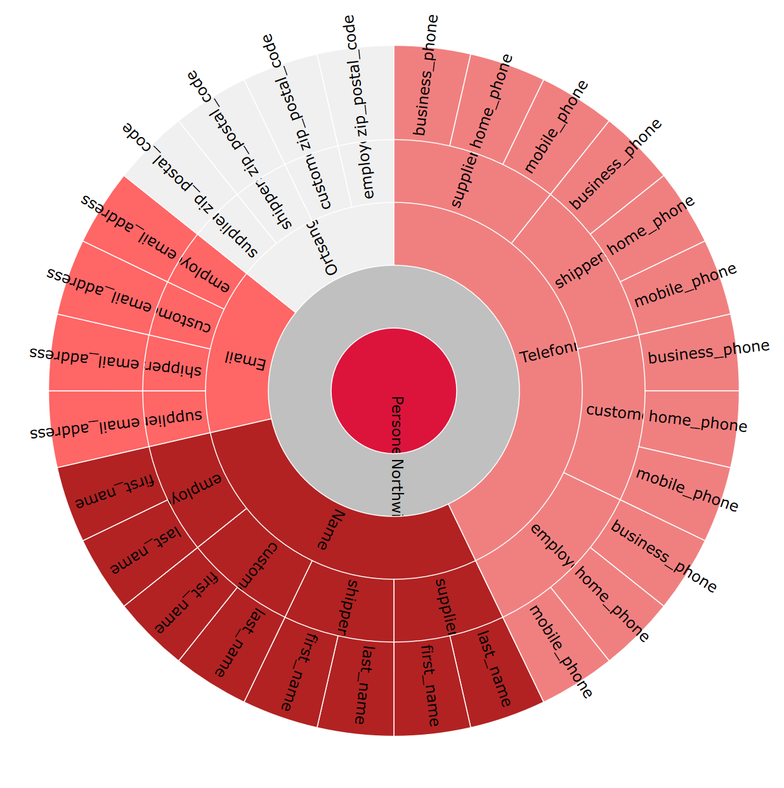
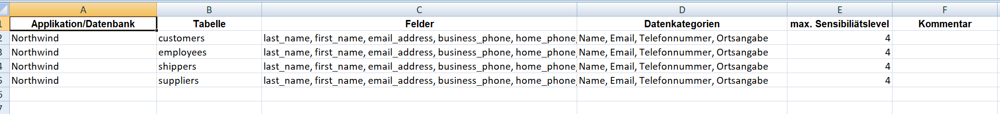
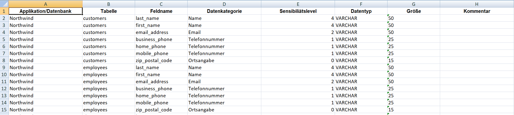
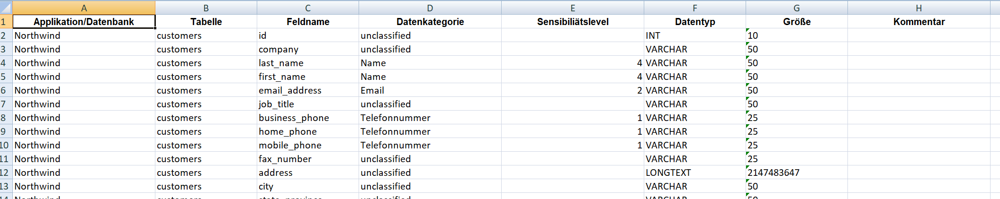

# KnowYourData - (Sensitive) Data Scanner 

## Purpose

The sensitive data scanner allows you to scan your database schema for sensitive data.

It will scan the schema = column names and match for names that indicate personal data.
You can extend this list on your own, it is built on regular expressions.
So in fact you can search your schema for any regular expression you like and rate it.
It is not limited to personal data.

It will output the results bascially in the format MS Excel.
Additionally, JSON files are provided for visualizing the tables/columns matched as personal data.

This software assists in creating and especially maintaining the records data processing activities by reading the
person-related data from the database schema. 
 
For more advanced scenarios (like reading from the database records) please see Commercial Version below.

## Installation Requirements
* Java JRE 1.7

## Usage
1.) Download the release (see releases)

2.) Build the data-scanner-core project:
mvn clean install

3.) Untar the  data-scanner-core-1.0-bin-release.tar

4.) Run the run.cmd/run.sh

=> this will generate the result files (Excel + JSON-files) into the result folder (based on northwind.sql) demo data.

5.) Fine-Tuning:
See the possible configuration files in the config directory.

* config.properties = Configure the input sources (JDBC or DDL) 
* messages.properties = customization of all labels. 
If you want german messages, please rename messages_de.properties to messages.properties
* classification.properties = Classify the column names to datacategories
* datacategory_sensitivity.properties = Classify the datacategories to sensitivity classes
* log4j.properties = LOG4J Logger configuration

## How it works
You can provide 
* JDBC url and login data or
* DDL-SQL-script (CREATE TABLE statements)

The program will scan the JDBC url (or DDL-SQL-script) provided and search for all column names in classification.properties.
Then it will determine the sensitivity using datacategory_sensitivity.properties.

## Results
The program will generate the following files:

* Excel file
   * Overview of all tables and the sensitive data they may hold
   * Detail overview for each table listing all sensitive columns
   * Data dictionary of all tables with all columns 

* JSON file with overview by application

* JSON file with overview by datacategory

=> Using the file index.html you can view the d3js / SVG diagram based on Json file overview by application.

[Download Excel](data-scanner-core/xdocs/sample_northwind/result/result.xlsx)

## Screenshots

The following screenshots are based on the Northwind database ported to mysql (available for download here https://github.com/dalers/mywind).

This is how you can visualize the tables/columns holding sensitive data to get a big picture

Note that you can move the mouse over the arcs in the dynamic version!

This is the first overview of tables holding sensitive data (including table remarks):

This is the listing of the columns and their classification (including column remarks):

You also get a complete data dictionary listing all tables/columns and their data sensitivity.

## Feedback and Support

If you need support or have questions please contact us at office@fwd.at

## Commercial version

Here is a short list of the features that support you exploring your data even more in the commercial version.

* Scan multiple datasources at once
* Data based database scanning
* Checking for Foreign Keys to visualize further usage of personal data

For more information please visit:

[Data scanner enterprise](http://www.fwd.at/) (by FWD GmbH).

## Credits
* Excel files are generated using the Apache POI project - https://poi.apache.org/
* SVG visualization is done using the d3js - https://d3js.org/
* The sunburst diagram is based on the sample diagram at https://bl.ocks.org/mbostock/4063423
* The sample results are based on the Northwind database port to mysql - https://github.com/dalers/mywind

## License

Copyright 2018 FWD GmbH

Licensed under the Apache License, Version 2.0; you may not use this file except in compliance with the License. You may obtain a copy of the License at apache.org/licenses/LICENSE-2.0

Unless required by applicable law or agreed to in writing, software distributed under the License is distributed on an "AS IS" BASIS, WITHOUT WARRANTIES OR CONDITIONS OF ANY KIND, either express or implied. See the License for the specific language governing permissions and limitations under the License.

